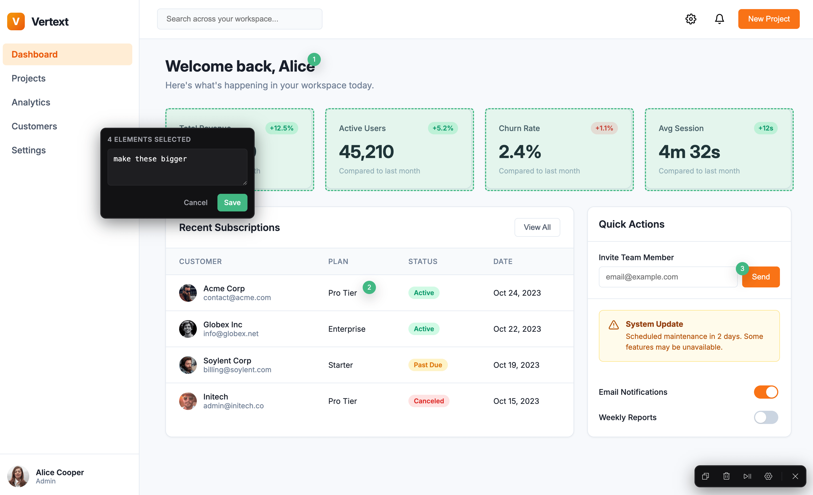

**vuepoint** is a visual feedback overlay for Vue 3 and Nuxt. Click any element, attach a note, and get a source-aware markdown report your coding agent directly act on.



## Install

```bash
npm install vuepoint -D
```

```bash
pnpm add -D vuepoint
```

## Usage

Vuepoint setup has two parts:

1. render `<Vuepoint />` in your root app component
2. add the vuepoint() plugin to your Vite or Nuxt config to capture exact file, line, and column references

### Root component setup

Render `Vuepoint` once in your top-level app component.

- Vue: put it in your root app component
- Nuxt: put it in `app.vue`

```vue
<script setup lang="ts">
import { Vuepoint } from "vuepoint";
import "vuepoint/style.css";
</script>

<template>
  <NuxtPage />
  <Vuepoint />
</template>
```

For a plain Vue app, replace `<NuxtPage />` with your root app content.

Vuepoint only runs in development. In production builds it renders nothing and attaches no listeners.

### Vue: vite.config.ts

```ts
import { defineConfig } from "vite";
import vue from "@vitejs/plugin-vue";
import { vuepoint } from "vuepoint/vite";

export default defineConfig({
  plugins: [vue(), vuepoint()],
});
```

### Nuxt: nuxt.config.ts

```ts
import { vuepoint } from "vuepoint/vite";

export default defineNuxtConfig({
  vite: {
    plugins: [vuepoint()],
  },
});
```


## Shortcuts

- `Cmd+Shift+V`: toggle the overlay
- `Shift+Click`: select multiple elements to annotate
- `Enter`: save an annotation
- `Shift+Enter`:  add a newline in an annotation
- `C`: copy all annotations to clipboard
- `X`: clear all annotations 
- `F`: freeze all animations and site interactions
- `Esc`: close the annotation draft / close vuepoint

## Source capture

Vuepoint adds a `data-vuepoint-loc` attribute to Vue template elements during local development. That is how it maps a selected DOM node back to a relative source path like `src/components/Button.vue:18:7`.

Without the Vite plugin, Vuepoint can still annotate elements visually, but exact source capture will be unavailable.

## Persistence

Annotations are stored in `localStorage` under the configured `storageKey` as a JSON array of annotations.

## Development

```bash
npm install
npm run dev
```

## License

MIT
